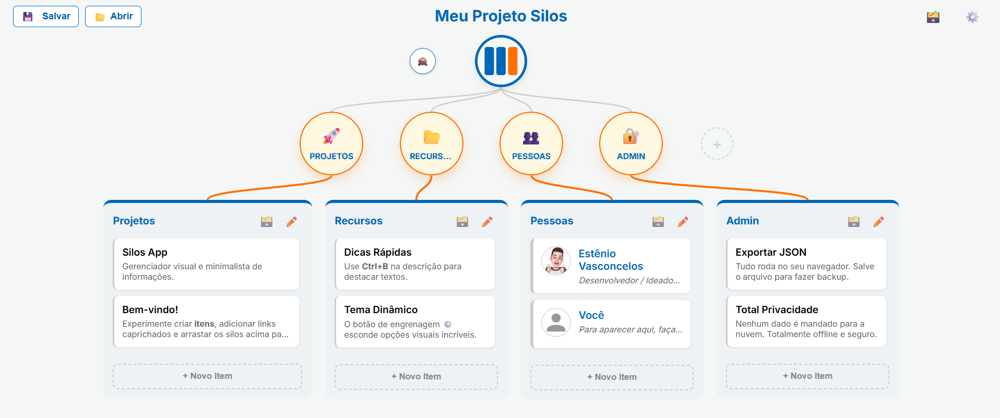

# Silos App 🗃️

Silos App é uma aplicação web focada em organização, categorização e produtividade através do conceito de "Silos". Crie grupos lógicos (Silos) para separar projetos, ideias e tarefas, e gerencie tudo em uma interface Kanban-like intuitiva com conexões visuais e sistema de Drag & Drop fluido.

## Funcionalidades Principais ✨
- **Estrutura de Silos e Itens**: Crie Silos para separar assuntos (ex: Projetos, Finanças, Ideias) e adicione cartões dentro deles.
- **Modo Kanban Integrado**: Arraste e solte cartões para ordená-los e, ativando nas configurações, mova cartões livremente entre diferentes Silos.
- **Interface Orgânica**: Linhas de conexão SVG se ligam dinamicamente da "Raiz" do projeto para cada Silo aberto.
- **Arquivamento**: Oculte Silos antigos ou concluídos sem perder seus dados, com a possibilidade de desarquivá-los a qualquer momento.
- **Personalização de Tema**: Escolha a cor principal, a cor de destaque e a cor de fundo com base na sua preferência. Tudo salvo no seu dispositivo localmente.
- **Armazenamento 100% Local**: O app funciona inteiramente no seu navegador, gravando as informações no seu LocalStorage sem necessidade de servidores externos.
- **Exportação/Importação em JSON**: Você pode fazer o backup de todo o seu projeto e exportar como JSON para uso em outro dispositivo.

## Como Usar 🚀
1. Basta abrir o arquivo `index.html` em qualquer navegador moderno.
2. Adicione seu primeiro Silo clicando no botão de **"+"**.
3. Escolha ícones (Emojis ou Imagens Personalizadas).
4. Clique no Silo para abrir a lista dele e começar a adicionar Itens.
5. Arraste e solte para organizar!
